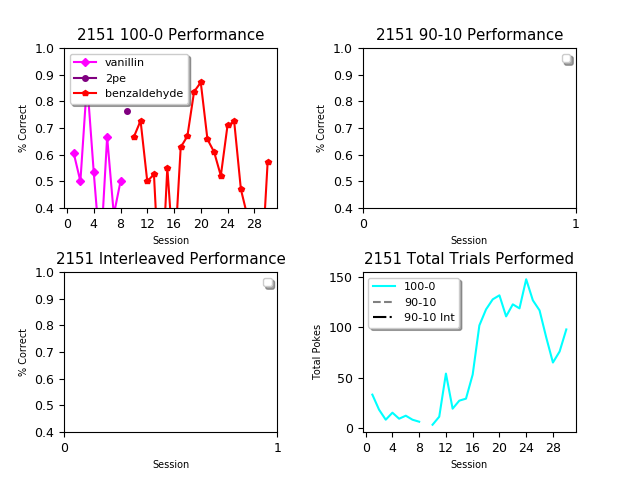
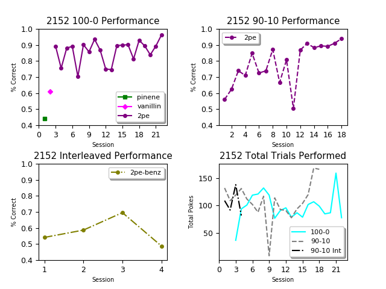
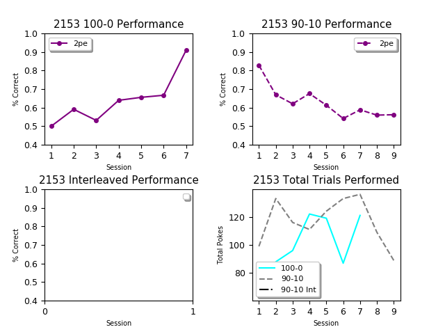
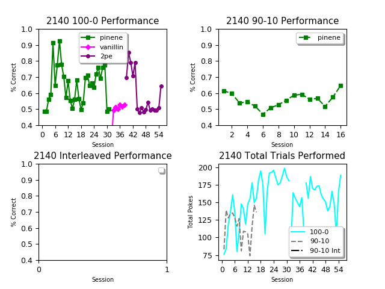
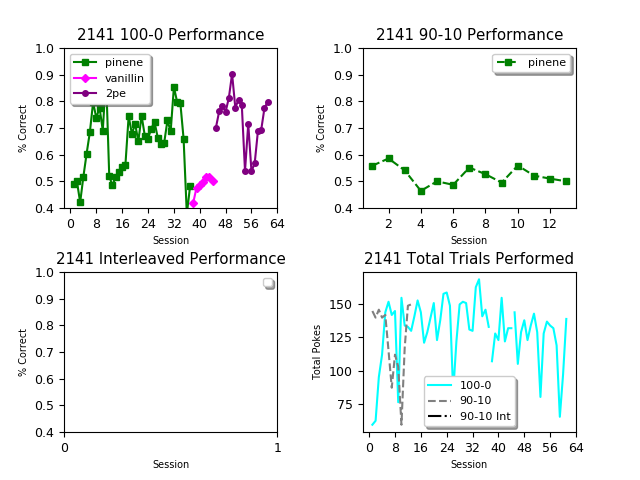
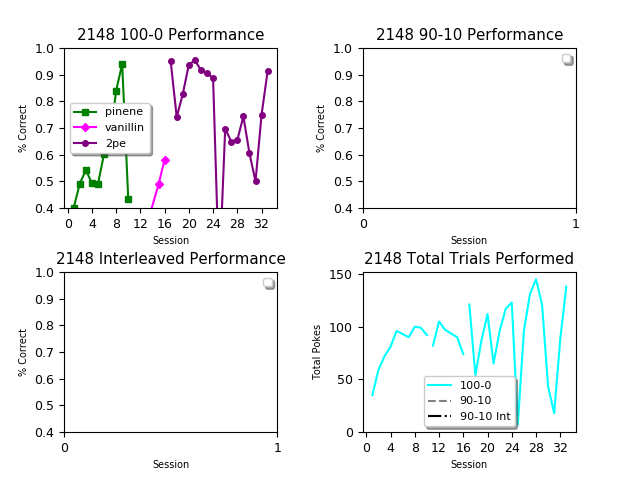
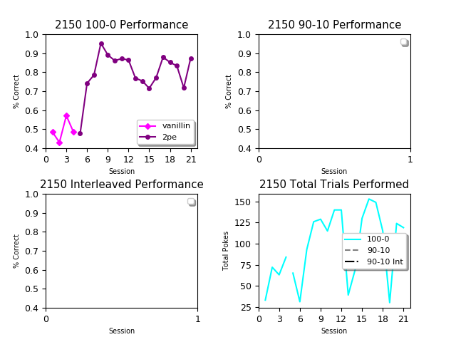

# FMON_DataManagement
  FMON data pipeline. 
  This repository receives pushes when generateData_v2.py is executed on FMON computer. 

<h2>Overall 100-0 Performance</h2>

Performance figures for individual mice  

  

<h3>Amanda's Mice<h3/>

